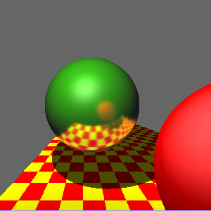
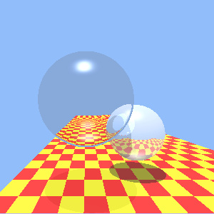

Title: CG2 - Raytracer
Date: 2005-04-02 02:28:00
Author: Sean Azlin
Category: RIT
Tags: Computer Graphics
Slug: CG2-Raytracer

Some renderings from my CG 2 raytracer. Built completely from scratch w/
C on a Sun workstation. <3

