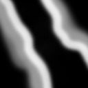
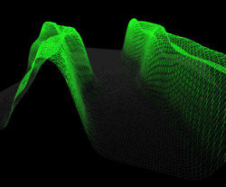

Title: DirectX Tri-strip
Date: 2006-04-02 03:27:00
Author: Sean Azlin
Category: RIT
Tags: Computer Graphics
Slug: DirectX-Tri-strip
Summary: Nothing makes you appreciate a graphics API more than when...

Nothing makes you appreciate a graphics API more than when you try to
render a terrain mesh without one:

