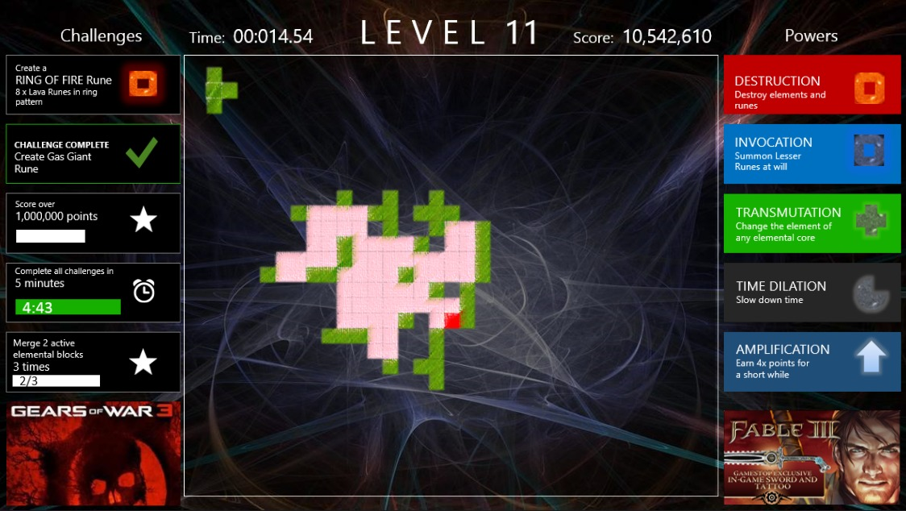
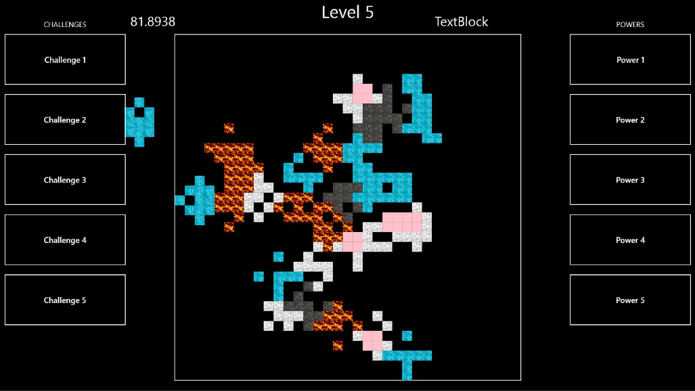
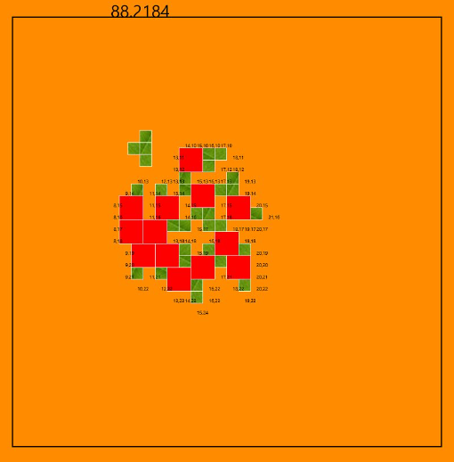
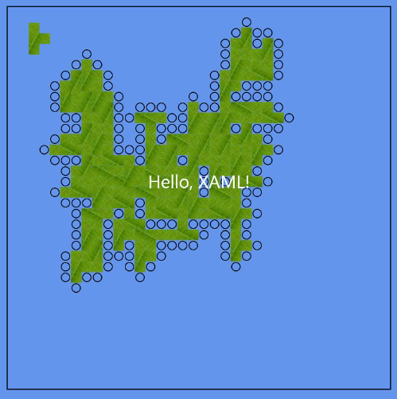

Title: Windows 8 Puzzle Game
Date: 2014-03-17 12:18:56
Author: Sean Azlin
Category: Side Projects
Tags: Game Development
Slug: win-8-puzzle-game-progress
Summary: Some ugly but fun screens from my current side project

Some ugly but fun screens from my current side project. The top screen
is a concept done in PowerPoint using a early prototype screenshot for
the game board.

The second screen is a screen shot of the latest prototype. The textures
are obviously super ugly for the various types of blocks (or "Runes"),
but lately I've been focused on getting the block snapping & alignment
algorithm to work correctly on devices with various screen sizes (7",
8", 10", etc.).

The third screen is a shot of when I was working some basic pattern
recognition into the game, since a big point of the game is to combine
runes into 2D patterns called "Glyphs". In this screen any 2x2 pattern
of green blocks was to be combined into a 2x2 red glyph. Success!

The last screen is one of the first screenshots that I took of the game
after I finished a first version of the snapping & alignment algorithm.
The circles represent "snap points" that active blocks are looking for
as they are moved around the game board.

